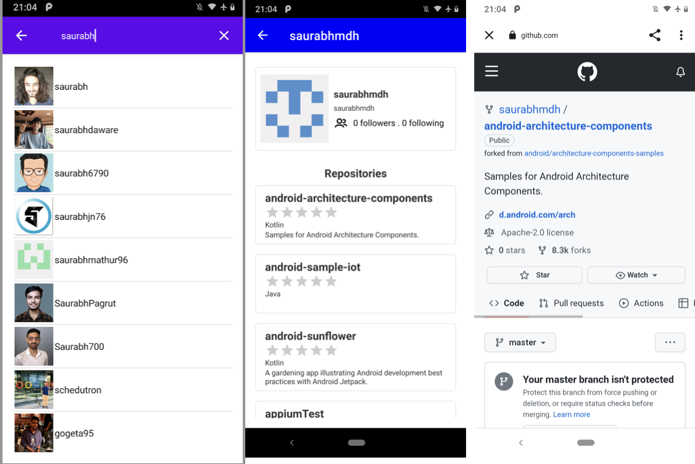

# Search GitHub users by keyword 

A search app illustrating Android development
a View-based app to Jetpack Compose.

## Screenshots

## Requirements
1. User search view
- A search box is fixed at the top of the screen.
- Display a list of users below the search box based on the input string.
- Icon image and user name should be listed on each line.
- Users can jump to the user repository view by tapping a line.

2. User repository view
- Displays detailed user information at the top of the list;
    - Icon Image
    - User name
    - Full name
    - Number of follows
    - Number of followers

- Display a list of the user's repositories, excluding forked repositories, under the user information;
    - Repository name
    - Program language
    - Number of stars
    - Description

- Allow users to tap a line and open the repository URL using Custom Tabs

Android Studio IDE setup
------------------------
For development, the latest version of Android Studio is required. The latest version can be
downloaded from [here](https://developer.android.com/studio/).

- Close Android Studio if it's open
- Start Android Studio

